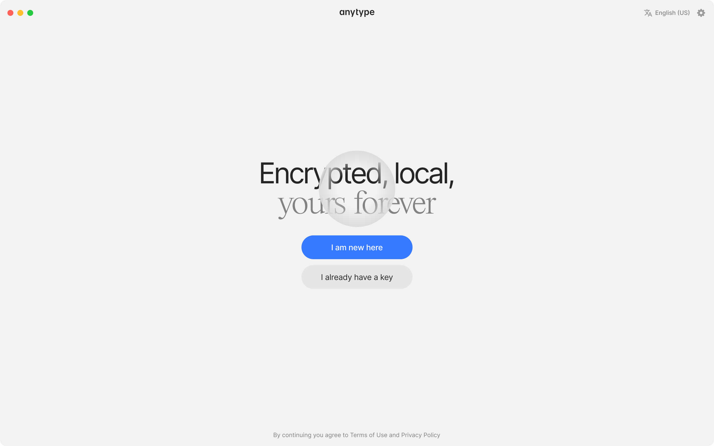
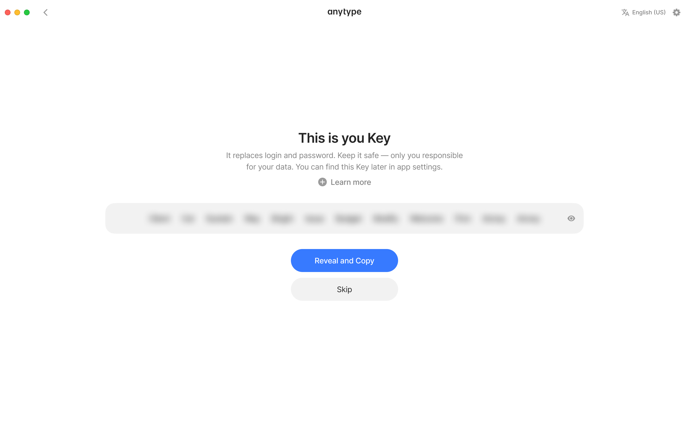

# Install

You can download the latest version of Anytype for your device at [download.anytype.io](https://download.anytype.io).

<figure><figcaption></figcaption></figure>

### Create your vault

<figure><figcaption></figcaption></figure>

If you haven't created a vault yet, you can easily create one by clicking on `I am new here` and then following the provided instructions.

**Language:** If you would like to use a language other than English for the interface, you can select it in the top right corner.

<figure><figcaption></figcaption></figure>

#### Save your Key!


Make sure you store your [key.md](vault-and-key/key.md "mention") somewhere safe, and try not to share it with anyone who can't be trusted!


<figure><figcaption></figcaption></figure>

#### Log-in using your Key

On the contrary, if you already have a vault, click on `I already have a Key` and enter your [key.md](vault-and-key/key.md "mention") to proceed.

<figure><figcaption></figcaption></figure>

#### Log-in using the QR code

In addition to using your [key.md](vault-and-key/key.md "mention") to log in, you can also use the QR code to login faster if your desktop is close by.

To log in using the QR code, simply navigate to [#login-key](../advanced/settings/account-and-data.md#login-key "mention") in your Vault Settings.

<figure><figcaption></figcaption></figure>

### Import

If you would like to import some of your existing data into your Space, you can find the instructions on how to do so in [import-export](../advanced/data-and-security/import-export/ "mention").

### What to expect after install

Once you've created your Vault and saved your Key, you'll land in your first Channel — **Get Started** — already populated with example Objects to help you explore. This is your sandbox: poke around, open things, break stuff, no pressure.

When you're ready to start your own work, **create a new Channel** for it:

* Click the **+** button at the top of the Vault (the leftmost panel) to create a new Channel.
* Inside your new Channel, create your first Object — a Note, a Task, or a Page.
* Type `/` in any Object to start adding rich content: headings, lists, images, embeds.

If you'd like a quick overview of how Anytype's core concepts fit together, start with [Learn the Model](learn-the-model.md).
